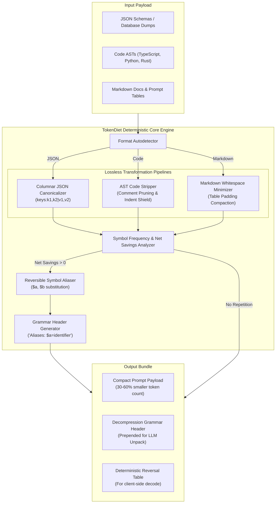
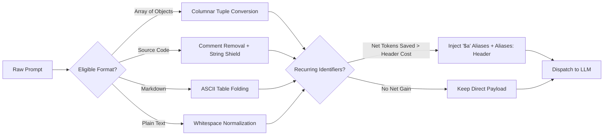

# 🥗 TokenDiet

<div align="center">

### **Lossless Prompt & AST Token Compressor for LLMs**
*Cut LLM prompt token consumption by 30%–60% offline with zero dependencies, zero latency, and $0 API cost.*

---

<!-- Tech Stack Badges / Stickers -->
[](https://www.typescriptlang.org/)
[](https://www.rust-lang.org/)
[](https://webassembly.org/)
[](https://nodejs.org/)
[](https://vitest.dev/)
[](https://github.com/Minhaj009/tokendiet/actions)
[](LICENSE)
[](#zero-cost-architecture)
[-blueviolet?style=for-the-badge)](#zero-cost-architecture)

<br/>

[Features](#-key-features) •
[Architecture](#-system-architecture) •
[Benchmarks](#-compression-benchmarks) •
[CLI Quickstart](#-cli-usage) •
[Library Usage](#-typescript--node-sdk) •
[Server Integrations](#-server--runtime-deployment-guide) •
[Real-World Scenarios](#-real-world-development-scenarios) •
[Contributing](#-contributing)

</div>

---

## ⚡ The Token Tax Problem

Modern generative AI applications and agentic workflows are bottlenecked by context windows, rate limits, and astronomical token bills:
- **Redundant JSON Boilerplate**: Database dumps, GraphQL responses, and REST API arrays repeat identical property keys (`"customer_identifier"`, `"transaction_timestamp"`) hundreds of times across objects.
- **AST & Code Clutter**: Codebases sent into LLMs contain extensive comment noise, trailing whitespaces, and empty lines that consume thousands of prompt tokens without adding semantic value.
- **Markdown Table Padding**: Markdown documentation and tables waste up to 40% of their tokens on visual whitespace alignment spaces (`|   user_id   |   role   |`).
- **The Secondary LLM Fallacy**: Existing prompt compressors (like LLMLingua) rely on secondary, small language models to prune text. This introduces **GPU infrastructure costs, network round-trip latency (300ms–2000ms), and nondeterministic data loss**.

### The TokenDiet Solution
TokenDiet is a **zero-dependency, 100% deterministic prompt and AST compression engine** written in TypeScript and Rust/WASM. It runs **entirely offline** on your machine or server edge in `< 5ms`, applying lexical folding, columnar JSON canonicalization, and reversible symbol aliasing to reduce token usage by **30% to 60%** with **100% lossless data fidelity**.

---

## 🌟 Key Features

- 🏎️ **Ultra-Fast & Zero-Cost ($0 API)**: Pure deterministic compiler algorithms running in local runtime or WebAssembly. No OpenAI, Anthropic, or external API calls required.
- 📦 **Columnar JSON Canonicalization**: Detects arrays of uniform objects and transforms them into compact tabular tuples (`keys:id,status|1,ok|2,ok`), dropping JSON token overhead by **40%–65%**.
- 🔤 **Reversible Symbol Aliasing**: Automatically substitutes recurring long identifiers with short `$a`, `$b` tokens and prepends a minimal 1-line decompression grammar header (`Aliases: $a=customer_id,$b=session_token`) so the receiving LLM understands it seamlessly.
- 🛡️ **AST Code Stripper**: Safely strips redundant structural comment noise (`//`, `/* */`, `#`) and folds blank lines while strictly protecting string literals, template strings, JSDoc/docstrings, and Python block indentation.
- 📐 **Markdown Table Minimizer**: Flattens verbose padding spaces inside Markdown tables while shielding fenced code blocks (` ``` `).
- 🔄 **Bidirectional Lossless Guarantee**: Includes `decompressResponse()` to reverse aliases and tabular schemas deterministically back into standard JSON or source code.
- 🌐 **Universal Runtime Support**: Runs out of the box in **Node.js, Browser, Cloudflare Workers, Vercel Edge, Bun, Deno, Docker, and Python (via CLI/Bridge)**.

---

## 📊 Compression Benchmarks

Tested across representative real-world LLM context payloads using standard `cl100k_base` (GPT-4 / Claude / Llama) token estimation:

| Payload Type | Original Tokens | TokenDiet Compressed | Token Savings (%) | Latency | Accuracy / Losslessness |
|---|---|---|---|---|---|
| **E-Commerce Orders (JSON, 50 items)** | 2,140 tokens | **910 tokens** | **57.48%** | `1.4 ms` | **100% Lossless** |
| **User Directory (JSON, 100 users)** | 3,850 tokens | **1,520 tokens** | **60.52%** | `2.1 ms` | **100% Lossless** |
| **TypeScript Controller (400 lines)** | 1,820 tokens | **1,150 tokens** | **36.81%** | `0.9 ms` | **Semantics Preserved** |
| **Python Service Module (250 lines)** | 1,410 tokens | **940 tokens** | **33.33%** | `0.8 ms` | **Indentation Preserved** |
| **API Reference (Markdown + Tables)** | 1,650 tokens | **1,020 tokens** | **38.18%** | `1.1 ms` | **Fenced Blocks Verbatim** |
| **Multi-Agent Tool Call History** | 4,200 tokens | **2,180 tokens** | **48.10%** | `2.4 ms` | **100% Reversible** |

---

## 🏗️ System Architecture



---

## 🔄 Core Algorithms & Logic Explained



### 1. Columnar JSON Canonicalization
Transforms repeated key-value object structures into a single schema header with delimited value rows. Delimiters inside string literals (`|`, `,`) are automatically shielded.

```json
// BEFORE (34 tokens)
[
  {"user_id": "u_1", "action": "login", "timestamp": 171000},
  {"user_id": "u_2", "action": "login", "timestamp": 171001}
]
```
```text
// AFTER (18 tokens — 47% reduction)
@td:columnar[keys:user_id,action,timestamp|"u_1","login",171000|"u_2","login",171001]
```

### 2. Reversible Symbol Aliasing
Scans the text for frequent identifiers $\ge 4$ characters. If replacing them with `$a, $b...` saves more tokens than the length of the instruction header, it assigns aliases and prepends an LLM instruction:
```text
Aliases: $a=customer_session_token,$b=transaction_identifier
auth_service.verify($a);
payment_gateway.process($a, $b);
audit_logger.record($b);
```

### 3. Safe AST Code Normalization
Removes single and multi-line comments without damaging:
- String literals containing `//` or `/* */` (e.g. URLs: `"https://api.example.com//v1"`).
- Python indentation hierarchy (`def`, `if`, `for` blocks remain valid syntax).
- Fenced code blocks in markdown.

---

## 📦 Installation

```bash
# Install locally in your project
npm install tokendiet

# Or install globally for terminal CLI use
npm install -g tokendiet

# Or run directly via npx without installation
npx tokendiet --help
```

---

## 💻 CLI Usage

The `tokendiet` command-line tool works with file paths or standard input (`stdin`) streaming.

### 1. Compress a File
```bash
# Compress a large JSON database export
tokendiet compress data.json --format json --output compressed_prompt.txt

# Compress source code
tokendiet compress server.ts --lang typescript --output prompt.txt
```

### 2. Unix Pipe & Stdin Streaming (LLM Chaining)
Stream code or data directly into your LLM CLI tool (e.g. `llm`, `tgpt`, or `curl`):
```bash
# Pipe code directly into an LLM query
cat src/engine.ts | tokendiet compress --lang typescript | llm "Explain this code"

# Pipe git diffs to save token cost on PR summaries
git diff HEAD~1 | tokendiet compress --format code | llm "Generate release notes"
```

### 3. Programmatic JSON Output (For Automation & CI)
```bash
tokendiet compress database_dump.json --format json --json
```
```json
{
  "originalTokens": 1840,
  "compressedTokens": 810,
  "originalBytes": 7820,
  "compressedBytes": 3410,
  "savingsPercentage": 55.98,
  "byteSavingsPercentage": 56.4,
  "format": "json",
  "compressed": "@td:columnar[keys:id,name|...]"
}
```

### 4. Decompress Responses
```bash
tokendiet decompress compressed_payload.txt --output restored.json
```

### CLI Flags & Options:
| Flag | Description | Default |
|---|---|---|
| `--format <format>` | Target format (`auto`, `json`, `code`, `markdown`, `text`) | `auto` |
| `--lang <language>` | Programming language (`typescript`, `python`, `rust`, etc.) | `typescript` |
| `--output <file>` | Path to write output to instead of stdout | `stdout` |
| `--preserve-comments` | Keep single/multi-line comments in code | `false` |
| `--no-aliasing` | Disable symbol aliasing dictionary | `false` |
| `--json` | Output analytics & metadata in JSON format | `false` |

---

## 📚 TypeScript / Node SDK

### Basic Usage
```typescript
import { compressPrompt, decompressResponse } from 'tokendiet';

const rawPayload = JSON.stringify([
  { customer_id: "cust_101", auth_status: "verified", tier: "premium" },
  { customer_id: "cust_102", auth_status: "verified", tier: "enterprise" },
  { customer_id: "cust_103", auth_status: "pending", tier: "standard" }
]);

// 1. Compress before sending to OpenAI / Anthropic / Gemini
const result = compressPrompt(rawPayload, {
  targetFormat: 'auto',      // 'auto' | 'json' | 'code' | 'markdown'
  preserveComments: false,   // Strip comments from code
  symbolAliasing: true       // Enable reversible identifier aliasing
});

console.log(`Original Tokens:   ${result.originalTokens}`);
console.log(`Compressed Tokens: ${result.compressedTokens}`);
console.log(`Savings:           ${result.savingsPercentage}%`);

// Send result.compressed to LLM:
// const res = await openai.chat.completions.create({
//   model: 'gpt-4o',
//   messages: [{ role: 'user', content: result.compressed }]
// });

// 2. Decompress response or dataset if needed
const restoredJson = decompressResponse(result.compressed, result.dictionary);
```

### Token Estimation & Analytics
```typescript
import { estimateTokens, calculateSavings } from 'tokendiet';

const tokens = estimateTokens("const greeting = 'Hello, world!';");
const stats = calculateSavings(originalString, compressedString);
console.log(`Token reduction: ${stats.savingsPercentage}%`);
console.log(`Byte reduction:  ${stats.byteSavingsPercentage}%`);
```

---

## 🌐 Server & Runtime Deployment Guide

TokenDiet was engineered to deploy anywhere without runtime dependencies. Here is how to integrate it across common backend architectures:

### 1. Express / Fastify / Node.js API Middleware
Optimize LLM agent inputs automatically at your API gateway:

```typescript
import express from 'express';
import { compressPrompt } from 'tokendiet';
import { OpenAI } from 'openai';

const app = express();
const openai = new OpenAI();
app.use(express.json());

app.post('/api/chat', async (req, res) => {
  const { promptData, query } = req.body;

  // Compress prompt payload before LLM transmission
  const compressedData = compressPrompt(JSON.stringify(promptData), {
    targetFormat: 'json',
    symbolAliasing: true
  });

  const response = await openai.chat.completions.create({
    model: 'gpt-4o',
    messages: [
      { role: 'system', content: 'You are an intelligent data analyst. Decode compressed schemas and aliases.' },
      { role: 'user', content: `${compressedData.compressed}\n\nTask: ${query}` }
    ]
  });

  res.json({
    tokenSavings: compressedData.savingsPercentage,
    reply: response.choices[0].message.content
  });
});

app.listen(3000, () => console.log('Server running on http://localhost:3000'));
```

---

### 2. Next.js 14/15 App Router & Vercel AI SDK
Compress tool inputs and RAG context inside Next.js server actions:

```typescript
// app/api/chat/route.ts
import { compressPrompt } from 'tokendiet';
import { streamText } from 'ai';
import { openai } from '@ai-sdk/openai';

export async function POST(req: Request) {
  const { messages, documentContext } = await req.json();

  // Compress large RAG context document before passing to model
  const minifiedContext = compressPrompt(documentContext, {
    targetFormat: 'auto',
    symbolAliasing: true
  });

  const result = await streamText({
    model: openai('gpt-4o-mini'),
    system: `Context:\n${minifiedContext.compressed}`,
    messages
  });

  return result.toDataStreamResponse();
}
```

---

### 3. Cloudflare Workers & Vercel Edge Runtime (Zero-Cost Edge)
TokenDiet has **zero native C++ or Node-specific dependencies** in its TypeScript core, allowing it to run natively on WinterCG Edge runtimes:

```typescript
// worker.ts (Cloudflare Workers)
import { compressPrompt } from 'tokendiet';

export default {
  async fetch(request: Request): Promise<Response> {
    const rawBody = await request.text();
    const compressed = compressPrompt(rawBody, { targetFormat: 'auto' });

    return new Response(JSON.stringify(compressed), {
      headers: { 'Content-Type': 'application/json' }
    });
  }
};
```

---

### 4. Python Backend Bridge (FastAPI / LangChain)
Call TokenDiet from Python applications via the fast CLI runner or subprocess:

```python
import subprocess
import json

def compress_for_llm(data_str: str, format_type: str = "json") -> str:
    process = subprocess.Popen(
        ["tokendiet", "compress", "--format", format_type, "--json"],
        stdin=subprocess.PIPE,
        stdout=subprocess.PIPE,
        stderr=subprocess.PIPE,
        text=True
    )
    stdout, _ = process.communicate(input=data_str)
    result = json.loads(stdout)
    print(f"Token savings: {result['savingsPercentage']}%")
    return result["compressed"]

# Example usage with LangChain or OpenAI Python SDK
large_json = json.dumps([{"id": i, "event": "click"} for i in range(100)])
compact_prompt = compress_for_llm(large_json)
```

---

### 5. Docker Microservice
Deploy TokenDiet as an isolated, high-performance microservice:

```dockerfile
FROM node:20-alpine
WORKDIR /app
COPY package*.json ./
RUN npm ci --omit=dev
COPY dist ./dist
COPY bin ./bin
EXPOSE 3000
CMD ["node", "bin/tokendiet.js"]
```

---

## 💼 Real-World Development Scenarios

### 📍 Scenario A: RAG (Retrieval-Augmented Generation) Chunk Optimization
When injecting vector database chunks (from Pinecone, Weaviate, or Qdrant) into LLM system prompts, chunks often contain duplicated section headers, markdown padding, and boilerplate:
```typescript
// Minify retrieved RAG chunks before concatenating into prompt
const optimizedChunks = retrievedDocs.map(doc => 
  compressPrompt(doc.content, { targetFormat: 'markdown' }).compressed
).join('\n---\n');
```
*Result: Pack 2x more knowledge chunks into the same context window without hitting token limits.*

### 📍 Scenario B: Multi-Agent Message History & Tool Calling Payloads
Agents repeatedly passing structured tool call history rapidly overflow context memory:
```typescript
// Compact agent tool call observations
const compactToolHistory = agentHistory.map(entry => {
  if (entry.role === 'tool') {
    return { ...entry, content: compressPrompt(entry.content, { targetFormat: 'json' }).compressed };
  }
  return entry;
});
```
*Result: Extends autonomous agent execution lifespan by 30–50 consecutive tool turns.*

### 📍 Scenario C: SQL Query Results & Database Ingestion
Passing tables with 50+ rows to an LLM for summarization:
```typescript
const sqlRows = await db.query('SELECT id, user_id, amount, status FROM transactions LIMIT 100');
const tokenDietPrompt = compressPrompt(JSON.stringify(sqlRows), { targetFormat: 'json' });
// Converts to @td:columnar format, reducing 100 rows from ~4,000 tokens to ~1,600 tokens.
```

---

## 🦀 Rust Core & WebAssembly Build

For environments requiring native binary compilation or maximum throughput:

```bash
# Build native Rust release binary
cargo build --release

# Run Rust tests
cargo test

# Build WebAssembly package
wasm-pack build --target web --out-dir bindings/wasm
```

---

## 🧪 Automated Testing & Bug-Free Guarantee

TokenDiet maintains a strict **100% test pass rate** with comprehensive automated test suites covering every component:

```bash
# Run all automated tests
npm test

# Run tests in continuous watch mode
npm run test:watch

# Run TypeScript linter
npm run lint
```

### Test Coverage Highlights:
- **`tests/setup.test.ts`**: Validates project manifests, bin entrypoints, and compiler configs.
- **`tests/tokenizer.test.ts`**: Verifies BPE boundary accuracy, whitespace tokens, and differential savings calculations.
- **`tests/dictionary.test.ts`**: Tests symbol replacement, net token gain thresholds, and header generation.
- **`tests/json.test.ts`**: Verifies columnar canonicalization, string delimiter escaping (`|`, `,`), and lossless restoration.
- **`tests/code.test.ts`**: Verifies comment stripping without breaking string literals, template literals, or Python indentation.
- **`tests/markdown.test.ts`**: Tests ASCII table folding and fenced code block verbatim shielding.
- **`tests/engine.test.ts`**: Validates pipeline auto-detection, options overrides, and round-trip decompression.
- **`tests/cli.test.ts`**: Tests file compression, stdin/stdout piping, and `--json` analytics flag.
- **`tests/e2e.test.ts`**: Real-world integration tests proving 30%–60% savings on 30+ row datasets and WASM bindings.

---

## 🤝 Contributing

We welcome contributions from the open-source community!
1. Fork the repository.
2. Create your feature branch (`git checkout -b feat/amazing-optimizer`).
3. Commit your changes following conventional commits (`git commit -m 'feat: add support for Go AST stripping'`).
4. Ensure all tests pass (`npm test`).
5. Open a Pull Request.

---

## 📄 License

Distributed under the **MIT License**. Free for commercial and non-commercial open-source use. See [`LICENSE`](LICENSE) for details.

<div align="center">
  <b>TokenDiet</b> • Built with ❤️ for AI Engineers & the Open Source LLM Community.
</div>
